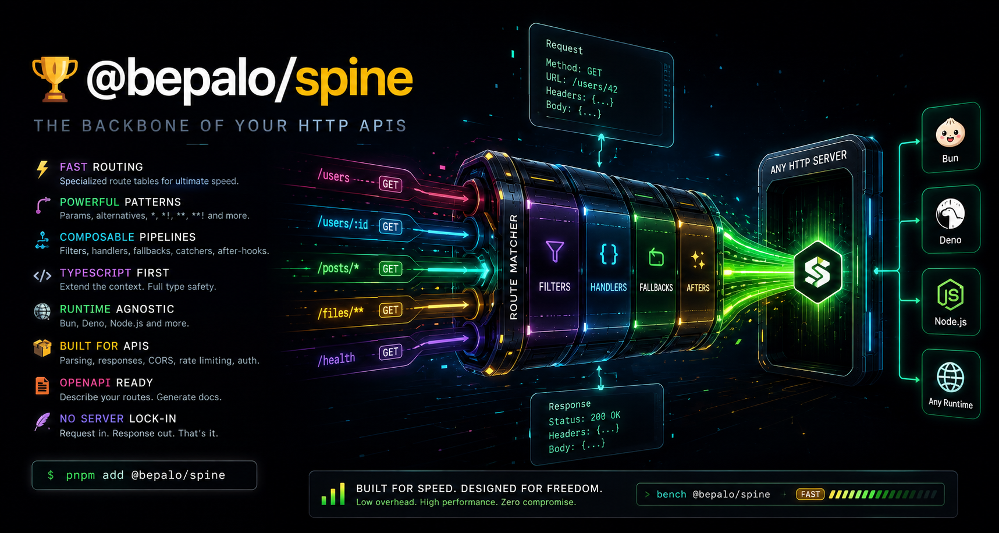

# 🏆 @bepalo/spine



[](https://www.npmjs.com/package/@bepalo/spine)
[](https://github.com/bepalo/spine/actions/workflows/ci.yaml)
[](https://github.com/bepalo/spine/actions/workflows/testing.yaml)
[](LICENSE)


<!--
[](test-result.md) -->

**A fast, runtime-agnostic HTTP router for JavaScript and TypeScript.**

Spine is a low-level routing layer built around the Web `Request`/`Response` APIs. It gives you fast, predictable route matching, typed contexts, composable handler pipelines, and the freedom to run it on top of any HTTP server.

```text
                       ( @Bepalo/spine )

                      ( The Router Pipeline )

                          ┌───────────────────────┐
                          ▼                       │
                   ┌──────┴───────┐               │
         ┌─────────│   Filters    │─────────┐ <request>
         │         └──────┬───────┘         │     │
         │      <no match nor response>     │     │
         │                ▼                 │     │
         │         ┌──────┴───────┐         │  ┌──┴────────┐
         ├─────────│   Handlers   │─────────┤  │   Server  │◄───┐
         │         └──────┬───────┘         │  └──┬─────┬──┘    │
         │      <no match nor response>     │     ▲     │   <request>
      <error>             ▼                 │     │ <response>  │
         │         ┌──────┴───────┐         │     │     ▼       │
         ├─────────│  Fallbacks   │─────────┤     │   ┌─┴───────┴─┐
         ▼         └──────┬───────┘         │     │   │   Client  │
   ┌─────┴──────┐         │   ┌──<response>─┘     │   └───────────┘
   │  Catchers  │         ▼   ▼                   │
   └─────┬──────┘  ┌──────┴───┴───┐               │
         └────────►│   Afters     │───────────────┘
  <error-response> └──────────────┘  <final-response>
```

```text
Benchmark Bun.serve baseline: @bepalo/spine vs Hono
Bun runtime · localhost · 20,000 sequential requests per route

              Bun          Spine          Hono     ┌──────────────┐
───────────────────────────────────────────────    │    Server    │
/             9.91k         8.64k         8.19k    └──────┬───────┘
exact        10.33k         8.42k         8.19k        Request
long exact   10.34k         8.28k         7.99k           ▼
one param     9.99k         8.16k         7.86k    ┌──────────────┐
two params   10.17k         8.04k         7.66k    │    Spine     │
three params  9.99k         7.68k         6.76k    │    Router    │
six params    9.88k         7.91k         7.51k    └──────┬───────┘
ten params    9.78k         7.90k         7.12k        Response
                                                          ▼
Average       10.05k        8.13k         7.65k    ┌──────────────┐
                                          ops/s    │    Server    │
                                                   └──────────────┘
    ████████████████████████████████████████ Bun
    █████████████████████████████████ Spine
    ████████████████████████████████ Hono
```

## Why Spine?

- ⚡ **Low-overhead routing** — specialized route tables for exact, glob, and super-glob routes
- 🎯 **Powerful route patterns** — parameters, alternatives, `*`, `*!`, `**`, and `**!`
- 🔗 **Composable pipelines** — filters, handlers, fallbacks, catchers, and after-hooks
- 🧠 **TypeScript-first** — extend the request context with your own application data
- 🌐 **Runtime agnostic** — works with Bun, Deno, Node.js, and other Web API-compatible runtimes
- 📁 **File-based routing** — optionally load routes directly from a directory structure
- 📖 **OpenAPI generation** — attach metadata to routes and generate an OpenAPI 3.0 document
- 🛠️ **Built-in utilities** — request parsing, responses, CORS, rate limiting, and authentication
- 🪶 **No server lock-in** — Spine only deals with `Request` in and `Response` out

## 📑 Table of Contents

- [Why Spine?](#why-spine)
- [Quick Start](#quick-start)
- [Routing](#routing)
  - [Parameters](#parameters)
  - [Alternatives](#alternatives)
  - [Wildcards](#wildcards)
  - [File-Based Wildcards](#file-based-wildcards)

- [Handler Pipeline](#handler-pipeline)
  - [Filter Pipes](#filter-pipes)
  - [Handler Pipes](#handler-pipes)

- [Type-Safe Context](#type-safe-context)
- [File-Based Routing](#file-based-routing)
- [Built for HTTP APIs](#built-for-http-apis)
  - [Request parsing](#request-parsing)
  - [Responses](#responses)
  - [CORS and rate limiting](#cors-and-rate-limiting)
  - [Authentication](#authentication)

- [OpenAPI](#openapi)
- [Error Handling](#error-handling)
- [Performance](#performance)
- [License](#-license)
- [Thanks and Enjoy](#️-thanks-and-enjoy)
- [Be a Sponsor](#-be-a-sponsor)

## Quick Start

Install

```sh
pnpm add @bepalo/spine
# or
npm install @bepalo/spine
# or
bun add @bepalo/spine
```

```ts
import {
  Router,
  json,
  text,
  toBase64UUID,
  parseBody,
  parseMultipart,
} from "@bepalo/spine";

// A user defined custom context shared accross the router
type CTSpineApp = { clientId: string; requestId: string };

const spine = new Router<CTSpineApp>();

spine.get("/", () => text("Hello, Spine!"));

// pipe specific context extension using CT* context extension types.
spine.get<CTQuery<"q" | "page">>("/search", [
  parseQuery(),
  ({ query: { q, page } }) => json({ q, page }),
]);

spine.get("/users/:id", ({ params: { id } }) => json({ id }));

spine.post<CTBody<object>>("/users", [
  parseBody({ accept: ["application/json"], maxSize: 1024 }),
  () => json({ created: true }, { status: 201 }),
]);

// Serve with Bun
Bun.serve({
  port: 3000,
  fetch: async (request, server) =>
    await spine.respond(request, {
      headers: new Header({ "X-Powered-By": "@bepalo/spine" }),
      requestId: toBase64UUID(crypto.randomUUID()), // compress UUID to base64url 'I6qNV82UTmulXhEhxHpZxw'
      clientId: server.requestIP(req).address ?? "anonymous",
    }),
});

// Serve with Deno
Deno.serve(
  {
    port: 3000,
  },
  (request) => async (request, server) =>
    await spine.respond(request, {
      headers: new Header({ "X-Powered-By": "@bepalo/spine" }),
      requestId: toBase64UUID(crypto.randomUUID()),
      clientId: remoteAddr.hostname ?? "anonymous",
    }),
);
```

That's the core API.

Spine does not create or manage your server. Your runtime gives Spine a standard `Request`, and Spine returns a standard `Response`.

```ts
const response = await spine.respond(request);
```

This makes the spine easy to embed into servers, frameworks, workers, and custom runtimes.

## Routing

Use the convenient HTTP method helpers:

```ts
spine.get("/users", handler);
spine.post("/users", handler);
spine.put("/users/:id", handler);
spine.patch("/users/:id", handler);
spine.delete("/users/:id", handler);
```

Or register several methods at once:

```ts
spine.all("/health", handler);
spine.crud("/users/:id", handler);
```

All standard HTTP methods are supported:

```text
HEAD  GET  POST  PUT  PATCH
DELETE  OPTIONS  TRACE  CONNECT
```

### Parameters

Parameters are detected from pathname using typescript. So, you have typesafety and autocomplete for that. Cool!

```ts
spine.get("/users/:userId/posts/:postId", ({ params }) => {
  return json({
    userId: params.userId,
    postId: params.postId,
  });
});
```

### Alternatives

A route segment can contain alternatives:

```ts
spine.get("/|about|contact", handler);
```

This matches:

```text
/
/about
/contact
```

Alternatives can also be combined with parameters:

```ts
spine.get("/api/|users|accounts/:id", handler);
```

### Wildcards

Spine supports single-segment and multi-segment wildcards:

```text
\*    one path segment
\*\!   optional single-segment suffix
\*\*   multiple path segments
\*\*\!  optional multi-segment suffix
```

For example:

```ts
spine.get("/files/*", handler);

spine.get("/api/**", ({ params }) => {
  console.log(params.$);
  console.log(params.$$);

  return json({ ok: true });
});
```

Use `*!` and `**!` when the wildcard portion is optional. `/abc/def/*!` will
match `/abc/def` while `/abc/def/*` will not.

### File-Based Wildcards

Filesystem-safe route names are provided for wildcard patterns:

```text
[#]     → *
[[#]]   → *!

[##]    → **
[[##]]  → **!
```

For example:

```text
routes/
└── api/
    └── [##].ts
```

maps to:

```text
/api/**
```

while:

```text
routes/
└── api/
    └── [[##]].ts
```

maps to:

```text
/api/**!
```

---

| ROUTER PATH                       | FILE PATH                         | MATCHES `highlighted`                                                                      |
| --------------------------------- | --------------------------------- | ------------------------------------------------------------------------------------------ |
| `/exact/path`                     | `/exact/path`                     | "/exact/path"                                                                              |
| `/slash/matters/`                 | `/slash/matters/`                 | "/slash/matters/"                                                                          |
| `/wild/glob/*`                    | `/wild/glob/[#]`                  | "/wild/glob/` `" "/wild/glob/`y`" "/wild/glob/`n`"                                         |
| `/wild/glob/match/base/*!`        | `/wild/glob/match/base/[[#]]`     | "/wild/glob/match/base" "/wild/glob/match/base/` `" "/wild/glob/match/base/`y`"            |
| `/globs/*/cool/*`                 | `/globs/[#]/cool/[#]`             | "/globs/` `/cool/" "/globs/`are`/cool/" "/globs/`are`/cool/`breath`"                       |
| `/globs/*/cool/*!`                | `/globs/[#]/cool/[[#]]`           | "/globs/` `/cool" "/globs/`are`/cool/` `" "/globs/` `/cool/breath" "/globs/`are`/cool/`y`" |
| `/named/:glob/here`               | `/named/[glob]/here`              | "/named/` `/here" "/named/`pet`/here/"                                                     |
| `/named/optional/:glob!`          | `/named/optional/[[glob]]`        | "/named/optional" "/named/optional/` `" "/named/optional/`pet`"                            |
| `/super/globs/**`                 | `/super/globs/[##]`               | "/super/globs/` `" "/super/globs/`here`" "/super/globs/`here/and/there`"                   |
| `/super/globs/**!`                | `/super/globs/[[##]]`             | "/super/globs" "/super/globs/` `" "/super/globs/`here`" "/super/globs/`1/2/3/4`"           |
| `/named/super/::slug`             | `/named/super/[## slug]`          | "/named/super/` `" "/named/super/`pet`" "/named/super/`man/town`"                          |
| `/named/super/::slug!`            | `/named/super/[[## slug]]`        | "/named/super" "/named/super/` `" "/named/super/`pet`" "/named/super/`man/town`"           |
| `/certain/a\|b\|c\|:options/y\|n` | `/certain/[[,a,b,c] options ]/y`  | "/certain/`a`/n" "/certain/`b`/y" "/certain/`c`/n" "/certain/` `/y"                        |
| `/certain/a\|b\|c:options!/y\|n`  | `/certain/[[a,b,c] [options] ]/n` | "/certain/`a`/y" "/certain/`b`/n" "/certain/`c`/y"                                         |

## Handler Pipeline

Spine separates request processing into explicit phases:

```text
                  ( @Bepalo/spine )
                   router pipeline
                         ┌───────────────────────┐
                         ▼                       │
                  ┌──────┴───────┐               │
        ┌─────────│   Filters    │─────────┐ <request>
        │         └──────┬───────┘         │     │
        │      <no match nor response>     │     │
        │                ▼                 │     │
        │         ┌──────┴───────┐         │  ┌──┴────────┐
        ├─────────│   Handlers   │─────────┤  │   Server  │◄───┐
        │         └──────┬───────┘         │  └──┬─────┬──┘    │
        │      <no match nor response>     │     ▲     │   <request>
     <error>             ▼                 │     │ <response>  │
        │         ┌──────┴───────┐         │     │     ▼       │
        ├─────────│  Fallbacks   │─────────┤     │   ┌─┴───────┴─┐
        ▼         └──────┬───────┘         │     │   │   Client  │
  ┌─────┴──────┐         │   ┌──<response>─┘     │   └───────────┘
  │  Catchers  │         ▼   ▼                   │
  └─────┬──────┘  ┌──────┴───┴───┐               │
        └────────►│   Afters     │───────────────┘
 <error-response> └──────────────┘  <final-response>
```

### Filter Pipes

The first handling stage of a request is done through the filter stage.
Use this stage to parse and validate the request.

```ts
spine.filterCrud<CTAuth>("/user/**!", [
  parseQuery(),
  parseCookie(),
  authenticate(),
  authorize(),
]);
spine.filterPost("/user", [
  parseCookie(),
  authenticate(),
  authorize(),
  parseBody(),
]);
```

### Handler Pipes

This is main handling stage of a request.

```ts
spine.get("/user/:id", []);
spine.filterPost("/user", [
  parseCookie(),
  authenticate(),
  authorize(),
  parseBody(),
]);
```

This lets cross-cutting behavior remain separate from your actual route handlers.

```ts
spine.filterGet("/api/**", [limitRate(), cors(), authenticate()]);

spine.get("/api/users", listUsers());

spine.fallbackGet("/api/**", () =>
  json({ error: "Not Found" }, { status: 404 }),
);

spine.catchGet("/api/**", ({ error }) =>
  json({ error: error?.message }, { status: 500 }),
);

spine.afterGet("/api/**", ({ response }) => {
  console.log(response.status);
  // even the response after a caught error will pass through the after-pipeline
  // error thrown here is not caught.
  // afters are best used for logging or modifying the final response
});
```

Handlers can also be composed into pipelines:

```ts
spine.post("/users", [parseBody(), validateUser(), createUser()]);
```

A pipeline can stop normally by returning a `Response`, or use Spine's explicit control symbols:

```ts
import { Break_Pipe, Break_Pipeline } from "@bepalo/spine";

spine.filterGet("/**", cors({ maxTokens: 60 }));
spine.filterGet("/api/**", [cors({ maxTokens: 200 }), () => Break_Pipeline]);. /* '/**' cors wont be called */

// Break_Pipeline breaks from the overall handlers pipeline while
// Break_Pipe breaks from the current handler pipe without returning a Response.

```

## Type-Safe Context

Every handler receives a context containing the request, URL, pathname, headers, route parameters, and spine.

You can extend it with your own application state:

```ts
type AppContext = {
  requestId: string;
  user?: {
    id: string;
    role: string;
  };
};

const spine = new Router<AppContext>();

type CTMore = { counter: { count: 0 } };

// context can be passed to the handler method for more specificity and need.
// Eg. cookie parsing, query parsing, body parsing, ... per pipe
spine.get<CTMore>("/profile", ({ requestId, user, counter }) =>
  json({
    requestId,
    user,
    counter,
  }),
);
```

Context values can be supplied when processing a request:

```ts
spine.respond(request, {
  requestId: crypto.randomUUID(),
});
```

This keeps runtime-specific concerns outside the spine itself.

## File-Based Routing

If you prefer filesystem-based routing, Spine can load routes from a directory:

```ts
const spine = new Router();

await spine.load({
  routesPath: "routes",
  // pattern: /\.route\.(.ts|.js)$/,
  // dirPattern: /.*/,
  // processName: (name) => name.substring(0, name.lastIndexOf(".")),
});
```

For example:

```text
routes/
├── index.ts
├── users.ts
├── [[products,pricing,contact] page]
├── users/
│   └── [id].ts
└── api/
    └── [##].ts
```

A route file exports its HTTP method handlers: in the format \<method\>\_\<handler-type\> or
a shortcut for handler \<method\>. eg. `Get`, `Get_Filter`.

**NOTE:** both \<handler-type\> and \<method\> are case-insensitive and you can decide how to name them as long as you adhere to the format \<method\>\_\<handler-type\> or \<method\>.

```ts
// routes/users.ts
import { json } from "@bepalo/spine";

const auth = [parseCookie(), authenticate()];

export const Get_Filter = [...auth, parseQuery()];

export const Post_Filter = [...auth, parseQuery(), parseBody(), vallidate()];

export const Get = () => json({ users: [] });

export const Post = () => json({ created: true }, { status: 201 });
```

A parameterized file:

```text
users/[id].ts
```

maps to:

```text
/users/:id
```

Special filesystem-safe patterns are available for wildcard routes:

```text
[#]     → *
[[#]]   → *!

[##]    → **
[[##]]  → **!
```

File routing is completely optional. The normal programmatic API remains the core of Spine.

## Built for HTTP APIs

Spine includes the common building blocks you usually end up adding around a spine.

### Request parsing

```ts
spine.post("/users", [parseBody(), ({ body }) => json(body)]);
```

Available parsers include:

- `parseBody`
- `parseQuery`
- `parseCookie`
- `parseHeaders`
- `parseMultipart`

Multipart parsing is streaming-oriented, making it suitable for large uploads.

### Responses

Common response helpers are included:

```ts
json(data);
text("Hello");
html("<h1>Hello</h1>");
status(204);
redirect("/login");
blob(file);
octetStream(data);
formData(data);
usp(params);
send(data);
```

Cookie helpers are also provided:

```ts
setCookie(name, value, options);
clearCookie(name, options);
```

### CORS and rate limiting

```ts
spine.filterAll("/api/**", [
  cors({
    origins: "*",
  }),

  limitRate({
    key: ({ request }) => request.headers.get("x-forwarded-for") ?? "unknown",
    maxTokens: 100,
    refillRate: 10,
  }),
]);
```

### Authentication

Authentication is intentionally application-defined:

```ts
spine.filterGet("/private/**", [
  authenticate({
    parseAuth: async ({ request }) => {
      const token = request.headers.get("authorization");

      if (!token) return undefined;

      return {
        role: "user",
      };
    },
  }),

  authorize({
    allowRole: (role) => role === "user",
  }),
]);
```

Basic Authentication is also supported through `basicAuthParser()`.

## OpenAPI

Add OpenAPI metadata directly to a handler:

```ts
spine.get(
  "/users/:id",
  ({ params }) =>
    json({
      id: params.id,
    }),
  {
    openApi: {
      summary: "Get a user",
      tags: ["Users"],
      responses: {
        "200": {
          description: "User",
        },
      },
    },
  },
);
```

Then generate an OpenAPI 3.0 document:

```ts
const document = await spine.generateOpenAPI({
  title: "My API",
  version: "1.0.0",
});
```

Route parameters are automatically represented using OpenAPI's `{parameter}` syntax.

## Error Handling

Throw an `HttpError` when you need an HTTP-specific failure:

```ts
import { HttpError } from "@bepalo/spine";

spine.get("/users/:id", ({ params }) => {
  const user = findUser(params.id);

  if (!user) {
    throw new HttpError(404, "User not found");
  }

  return json(user);
});
```

Handle errors with a catcher:

```ts
spine.catchGet("/users/**", ({ error }) =>
  json({ error: error?.message }, { status: 500 }),
);
```

## Multipart Parser Demo

This is a well tested multipart-form-data parser that parses by streaming chunks.
It can even handle edge cases like boundary across multiple chunks and very small chunks (down to 5 bytes of chunk). Thank God!

```ts
router.post("/upload", [
  parseMultipart<
    // Context extension
    {},
    // Parsed formdata file extension
    // we will use this to store uploaded file related state
    {
      totalChunks: number;
      prevProgress: number;
      handle: Bun.FileBlob;
      writer: Bun.FileSink;
    }
  >({
    // // same as default implementation
    // idGenerator: () => toBase64UUID(crypto.randomUUID()),
    // idGenerator: ({ name }) => name,

    onHeader: async (ctx, { headers, id, name, filename, file }) => {
      console.log("[Upload](onHeader)", id);
      // ctx.currentId = "upload_" + toBase64UUID(crypto.randomUUID());
      if (file) {
        const ext = file.name.substring(file.name.lastIndexOf("."));
        const uploadPath = process.cwd() + "/uploads/" + id + ext;
        const targetFile = Bun.file(uploadPath);
        if (await targetFile.exists()) {
          throw new HttpError(500, `File already exists`);
        }
        file.totalChunks = 0;
        file.prevProgress = 0;
        file.handle = targetFile;
        file.writer = targetFile.writer();
        // print progress start
        console.log(
          name,
          filename,
          "0%",
          file.totalSize ? file.totalSize + " bytes" : "-",
        );
      } else {
        ctx.fields.set(name, "");
      }
    },

    onData: (ctx, { chunk, id, name, filename, file }) => {
      if (file) {
        file.writer.write(chunk);
        file.totalChunks++;
        // file.crc.update(chunk);
        // progress
        if (file.totalSize) {
          const progress = (file.size / file.totalSize) * 100;
          // print progress every 10% increment
          const truncProgress = Math.trunc(progress / 10);
          if (truncProgress > file.prevProgress) {
            console.log(name, filename, progress.toFixed(2) + "%");
            file.prevProgress = truncProgress;
          }
        }
      } else {
        ctx.fields.set(
          name,
          ctx.fields.get(name)! + new TextDecoder().decode(chunk),
        );
      }
    },

    onDataCompletion: (ctx, { headers, id, name, filename, file }) => {
      console.log("[Upload](onDataCompletion)", id);
      if (file) {
        file.writer.end();
        delete file.handle;
        delete file.writer;
        console.log(file);
      } else {
        // parse json
        const contentTypeHeader = headers.get("content-type");
        if (contentTypeHeader?.startsWith("application/json")) {
          ctx.fields.set(name, JSON.parse(ctx.fields.get(name)!));
        }
        console.log({ [name]: ctx.fields.get(name)! });
      }
    },

    onStart: () => {
      console.log("[Upload](onStart)");
    },

    onEnd: ({ files, fields }, { success, error }) => {
      if (!success) {
        console.error("[Upload](onEnd)", error);
        return json({ error: error?.message });
      }
      console.log("[Upload](onEnd)");
      console.log({ fields, files });
      return json({ message: "Upload successful" });
    },
  }),
]);
```

## Performance

Spine keeps routing deliberately simple and specialized:

- Exact routes use direct route tables.
- Glob routes are stored separately from exact routes.
- Super-glob routes are handled independently.
- Routes are organized by HTTP method.
- Pathnames are split once and reused during matching.
- Parameter extraction happens only for the selected route candidates.

The result is a spine focused on **fast matching, low overhead, and predictable behavior** without tying the routing layer to a particular server.

## 📄 License

[MIT](/LICENSE)

## 🕊️ Thanks and Enjoy

If you find Spine useful, please consider starring the repository and sharing it with others.

## 💖 Be a Sponsor

Support development and future improvements.

<a href="https://ko-fi.com/natieshzed">
  
</a>
